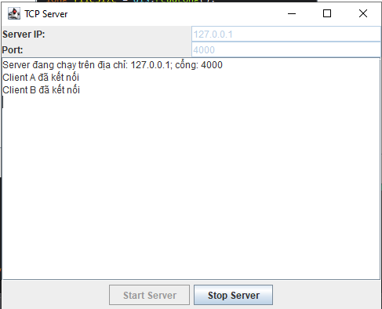
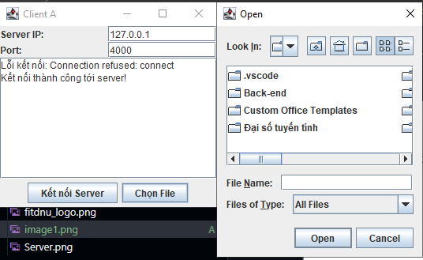
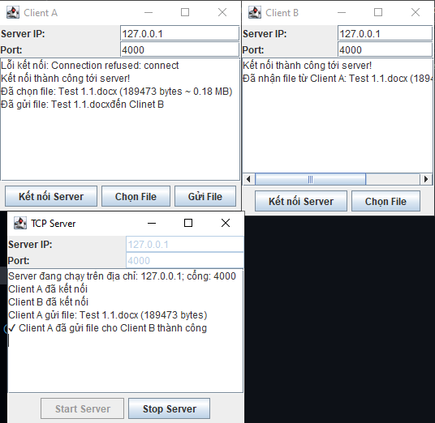

<h2 align="center">
    <a href="https://dainam.edu.vn/vi/khoa-cong-nghe-thong-tin">
    🎓 Faculty of Information Technology (DaiNam University)
    </a>
</h2>
<h2 align="center">
   TRUYỀN FILE QUA GIAO THỨC TCP
</h2>

    

        
        
        
    

## 📖 1. Giới thiệu
Trong thời đại công nghệ thông tin phát triển mạnh mẽ, nhu cầu trao đổi và chia sẻ dữ liệu giữa các máy tính ngày càng phổ biến. Một trong những phương thức quan trọng và được sử dụng rộng rãi là truyền file qua giao thức TCP (Transmission Control Protocol).

TCP là giao thức hướng kết nối, đảm bảo tính tin cậy, toàn vẹn và đúng thứ tự dữ liệu trong quá trình truyền. Nhờ đó, việc truyền file qua TCP có thể áp dụng cho nhiều hệ thống thực tế như: dịch vụ FTP, ứng dụng chat, hệ thống lưu trữ dữ liệu phân tán, hay các phần mềm hỗ trợ tải xuống.

🔑 **Các chức năng chính của hệ thống**:

-Kết nối Client – Server qua TCP Socket.

-Truyền và nhận file giữa các client.

-Hiển thị tiến trình truyền và nhận file .

-Lưu file tự động vào thư mục chỉ định.

## 🛠️ 2. Công nghệ sử dụng

**Ngôn ngữ lập trình**: Java

**Giao thức**: TCP,TCP Socket

**Công nghệ giao diện**: Java Swing

**Thư viện**:

-java.net 

-java.io 

**Công cụ phát triển**: Eclipse IDE

**Hệ điều hành**: Windows 10

**JDK**: Java SE

## 🚀 3. Hình ảnh các chức năng

  

  <em>Hình 1: Giao diện Server  </em>

  

  <em>Hình 2: Giao diện Client A  </em>

  

  <em>Hình 3: Giao diện Client B  </em>

  

  <em>Hình 4: Giao diện khi Server đã chạy và các Client đã kết nối  </em>

  

  <em>Hình 5: Giao diện Khi chọn File  </em>

  

  <em>Hình 6: Giao diện khi gửi File  </em>

  

  <em>Hình 7: Giao diện khi dừng Server  </em>

## 📝 4. Các bước cài đặt

**Bước 1: Chuẩn bị môi trường**

**Cài Java JDK**.

-java -version

-javac -version

**Bước 2: Tạo Project**

Tạo một project Java.

Tạo package: Giao_Thuc_TCP.

Thêm 3 file Java vào package:

Server.java

ClientA.java

ClientB.java

**Bước 3: Gõ code**

Copy code Server.java.

Copy code ClientA.java.

Copy code ClientB.java.

 Sau đó Build Project để IDE biên dịch.

**Bước 4: Chạy chương trình**

Thứ tự chạy:

-Chạy Server trước

-Nhập IP: 127.0.0.1 (hoặc IP LAN nếu chạy nhiều máy).

Port: 4000 (hoặc số khác bạn set).

-Bấm Start Server.

-Log hiển thị: Server đang chạy trên địa chỉ: 127.0.0.1; cổng: 4000.

-Chạy ClientA

-Nhập IP server (mặc định 127.0.0.1).

-Port: 4000.

-Bấm Kết nối Server.

-Chạy ClientB (tương tự ClientA).

**Bước 5: Gửi file**

Trên ClientA:

-Bấm Chọn File → chọn file bất kỳ.

-Bấm Gửi File → log hiển thị: Đã gửi file: tên_file ....

-Trên ClientB → log hiển thị: Đã nhận file từ server: tên_file ....

-File sẽ được lưu vào thư mục Files_ClientB.

-Ngược lại, nếu gửi từ ClientB thì ClientA sẽ nhận được file.

**Kết quả**

Server log:

ClientA gửi file tới ClientB thành công

hoặc

ClientB gửi file tới ClientA thành công

© 2025 AIoTLab, Faculty of Information Technology, DaiNam University. All rights reserved.

---
